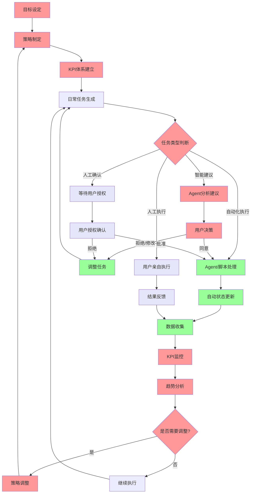

# Seven-Step PDCA框架 (Seven-Step PDCA Framework)

基于经典PDCA循环的增强型人机协作框架，将传统四步循环扩展为七步闭环模型，实现更精细化的管理和执行控制。

## 框架理论基础

该框架具有强通用性，基于经典PDCA循环理论，扩展为**七步闭环模型**：

**目标 → 策略 → KPI体系 → 执行 → 监控 → 分析 → 调整**

### PDCA循环映射

七步模型与经典PDCA循环的对应关系：

```
PDCA经典循环     ←→  七步闭环模型
Plan (计划)      ←→  目标 → 策略 → KPI体系
Do (执行)        ←→  执行  
Check (检查)     ←→  监控 → 分析
Act (改进)       ←→  调整
```

这种扩展设计的优势：
- **计划阶段细化**：将Plan分解为目标设定、策略制定、KPI建立三个环节
- **检查阶段增强**：将Check分为监控（实时）和分析（深度）两个层次
- **保持PDCA本质**：维持经典管理循环的核心逻辑和理论基础

## 框架适用性

这个模型适用于任何领域或项目，因为它体现了管理的基本规律：
- **目标导向**: 明确要达成什么
- **策略规划**: 确定实现路径
- **量化管理**: 建立衡量标准
- **执行落地**: 具体行动实施
- **过程监控**: 实时跟踪进度
- **数据分析**: 数据驱动-发现问题和机会
- **迭代优化**: 持续改进提升

## Seven-Step PDCA模型中的三位一体协作

| 框架环节 | 人类职责 | Agent职责 | 脚本职责 |
|---------|---------|-----------|----------|
| 目标 | 目标设定、优先级 | 目标分解建议 | 目标记录、模板 |
| 策略 | 策略决策、方向 | 策略分析、选项 | 策略文档化 |
| KPI体系 | KPI确认、权重 | KPI建议、基准 | KPI配置、计算 |
| 执行 | 关键任务执行 | 任务调度管理 | 自动化执行 |
| 监控 | 异常处理决策 | 实时数据收集 | 状态更新、提醒 |
| 分析 | 趋势判断、洞察 | 数据分析、报告 | 报告生成、存档 |
| 调整 | 调整决策 | 调整建议 | 参数更新、记录 |

## Seven-Step PDCA模型优势特征

**1. 逻辑完整性**
- **战略规划层**: 目标 → 策略 → KPI体系 (What, How, Measure)
- **执行管理层**: 执行 → 监控 (Do, Track)  
- **优化改进层**: 分析 → 调整 (Learn, Improve)
- 形成完整的增强型PDCA循环

**2. 标准化但灵活**
- 框架结构固定，保证完整性
- 具体内容可变，适应不同场景

**3. 可度量可复制**
- 每个环节都有明确的输入输出
- 便于跨项目、跨领域的经验复用

**4. 自我优化**
- 内置反馈循环，自动驱动改进
- 数据积累越多，决策越精准

不同领域只需适配：
- **人类角色定义** (决策者的专业背景和职责)
- **Agent能力配置** (智能助手的专业知识和分析能力)  
- **脚本规则设置** (该领域的SOP和工具集)

而Seven-Step PDCA框架模型保持不变，确保了工作流的标准化和可复制性。

## SOP工作流程图



**图例说明:**
- 🔴 红色: 决策分析层 (Agent建议 + 人类决策)
- 🟢 绿色: Agent/脚本执行层 (自动化处理)
- ⚪ 紫色: 人类执行层 (人工操作 + 确认)

## 协作模式

### 🔴 决策分析层 (Agent建议 + 人类决策)
- **特征**: Agent提供数据分析和建议，人类做最终决策
- **适用**: 目标设定、策略制定、KPI建立、优先级排序、资源分配、趋势分析、策略调整
- **流程**: Agent分析 → 多选项建议 → 人类选择 → 执行

### 🟢 Agent/脚本执行层 (自动化处理)
- **特征**: Agent/脚本自动处理，无需人工干预
- **适用**: 数据收集、报告生成、状态更新、文件整理、任务调整
- **约束**: SOP规则严格限制，确保合规性

### ⚪ 人类执行层 (人工操作 + 确认)
- **特征**: Agent/脚本无法完成，必须人工执行或确认
- **适用**: 现场会谈、实地调研、复杂谈判、创意工作、重要决策授权
- **闭环**: 执行完成后结构化反馈，自动更新系统状态