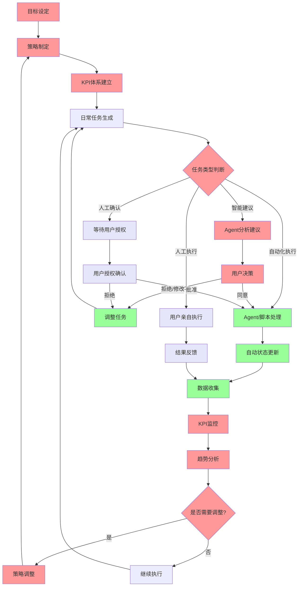

# 通用人机协作工作流框架 (Universal Human-AI Workflow Framework)

## 核心理念

基于Iron Man中Jarvis模式的现实版本：**人类专注战略决策（目标、策略、KPI体系、监控、分析、调整），AI负责执行优化**

这种SOP框架强调**人类、Agent、脚本各司其职，各自发挥其强项**：
- **人类强项**: 战略思考、创意决策、复杂判断、现实世界交互
- **Agent强项**: 数据分析、模式识别、智能建议、学习优化
- **脚本强项**: 流程固化、状态管理、合规约束、自动执行

### 三位一体的协作架构

**人类 - 决策中枢**
- 战略思考、创意决策、复杂判断、现实世界交互
- 拥有最终决策权和方向把控权

**Agent - 智能助手**  
- **上辅助决策**: 数据分析、模式识别、智能建议、趋势预测
- **下管理执行**: 任务调度、进度跟踪、异常处理、流程优化
- 连接人类决策与脚本执行的智能桥梁

**脚本 - 工具集合**
- **SOP固化工具**: 流程固化、状态管理、合规约束、自动执行
- **Agent工具集**: 为Agent提供标准化的操作能力和数据接口
- 确保执行的一致性和可靠性

### 框架通用性

该框架具有强通用性，基于不变的**七步闭环模型**：

**目标 → 策略 → KPI体系 → 执行 → 监控 → 分析 → 调整**

这个模型适用于任何领域或项目，因为它体现了管理的基本规律：
- **目标导向**: 明确要达成什么
- **策略规划**: 确定实现路径
- **量化管理**: 建立衡量标准
- **执行落地**: 具体行动实施
- **过程监控**: 实时跟踪进度
- **数据分析**: 数据驱动-发现问题和机会
- **迭代优化**: 持续改进提升

#### 七步模型中的三位一体协作

| 框架环节 | 人类职责 | Agent职责 | 脚本职责 |
|---------|---------|-----------|----------|
| 目标 | 目标设定、优先级 | 目标分解建议 | 目标记录、模板 |
| 策略 | 策略决策、方向 | 策略分析、选项 | 策略文档化 |
| KPI体系 | KPI确认、权重 | KPI建议、基准 | KPI配置、计算 |
| 执行 | 关键任务执行 | 任务调度管理 | 自动化执行 |
| 监控 | 异常处理决策 | 实时数据收集 | 状态更新、提醒 |
| 分析 | 趋势判断、洞察 | 数据分析、报告 | 报告生成、存档 |
| 调整 | 调整决策 | 调整建议 | 参数更新、记录 |

#### 模型优势特征

**1. 逻辑完整性**
- **战略规划层**: 目标 → 策略 → KPI体系 (What, How, Measure)
- **执行管理层**: 执行 → 监控 (Do, Track)  
- **优化改进层**: 分析 → 调整 (Learn, Improve)
- 形成完整的PDCA循环

**2. 标准化但灵活**
- 框架结构固定，保证完整性
- 具体内容可变，适应不同场景

**3. 可度量可复制**
- 每个环节都有明确的输入输出
- 便于跨项目、跨领域的经验复用

**4. 自我优化**
- 内置反馈循环，自动驱动改进
- 数据积累越多，决策越精准

不同领域只需适配：
- **人类角色定义** (决策者的专业背景和职责)
- **Agent能力配置** (智能助手的专业知识和分析能力)  
- **脚本规则设置** (该领域的SOP和工具集)

而七步框架模型保持不变，确保了工作流的标准化和可复制性。

### 框架可扩展性

该框架具备从**个人创业到企业规模**的可扩展性：

**初期阶段（1人创业）**：
- 创业者既是决策中枢，也是主要执行人
- Agent承担策略分析助手和项目经理角色
- 脚本处理大量重复性事务
- 避免被琐碎管理事务淹没，专注核心战略

**发展阶段（小团队）**：
- 创业者专注决策和关键战略
- Agent管理团队协作和执行监控
- 团队成员承担具体执行任务
- 分工更加明确和专业化

**成熟阶段（多人公司）**：
- 可设立专门的决策和分析团队
- Agent协调多层级管理和执行
- 执行层可扩展到多个部门和项目
- 保持统一的工作流框架

### Agent能力定位

基于当前AI发展水平的现实设计：

**Agent在决策分析上**：目前无法独当一面，采用**辅助模式**
- 角色：策略和分析助手
- 功能：数据收集、模式识别、方案建议
- 限制：最终决策仍需人类判断

**Agent在管理执行上**：能力已足够胜任，采用**主导模式**
- 角色：项目经理兼执行协调者
- 功能：任务调度、进度跟踪、异常处理
- 优势：7x24小时监控，不遗漏细节

这样的设计让人类避免被琐碎事务淹没，集中精力在核心的策略、决策、分析和关键工作上。即便Agent未来发展到可以完全替代人类决策，这种框架仍然适用，只需调整权限配置即可。

## SOP工作流程图



**图例说明:**
- 🔴 红色: 决策分析层 (Agent建议 + 人类决策)
- 🟢 绿色: Agent/脚本执行层 (自动化处理)
- ⚪ 紫色: 人类执行层 (人工操作 + 确认)

## 系统架构

```
用户 (决策中枢)
  ↕ 监控面板交互
Agent (智能助手层) 
  ↕ MCP协议通信
MCP服务器 (约束管理层)
  ↕ API调用
SOP脚本 (工具执行层)
  ↕ 文件系统
数据存储 (持久化层)
```

## 协作模式

### 🔴 决策分析层 (Agent建议 + 人类决策)
- **特征**: Agent提供数据分析和建议，人类做最终决策
- **适用**: 目标设定、策略制定、KPI建立、优先级排序、资源分配、趋势分析、策略调整
- **流程**: Agent分析 → 多选项建议 → 人类选择 → 执行

### 🟢 Agent/脚本执行层 (自动化处理)
- **特征**: Agent/脚本自动处理，无需人工干预
- **适用**: 数据收集、报告生成、状态更新、文件整理、任务调整
- **约束**: SOP规则严格限制，确保合规性

### ⚪ 人类执行层 (人工操作 + 确认)
- **特征**: Agent/脚本无法完成，必须人工执行或确认
- **适用**: 现场会谈、实地调研、复杂谈判、创意工作、重要决策授权
- **闭环**: 执行完成后结构化反馈，自动更新系统状态

## 核心组件

### 1. SOP脚本引擎
- **功能**: 工作流程固化、状态机管理、约束检查
- **特点**: 确保流程合规性，防止关键步骤遗漏

### 2. MCP服务器
- **功能**: Agent工具集成、权限控制、数据中介
- **特点**: 标准化AI接口，灵活扩展能力

### 3. 监控面板
- **功能**: 数据可视化、Agent交互、权限管理
- **特点**: 唯一图形界面，统一控制中枢

### 4. 反馈机制
- **功能**: 人工任务结果收集、智能分析、闭环更新
- **特点**: 结构化反馈，自动影响分析

### 5. 人工执行闭环
- **功能**: 处理Agent/脚本无法完成的任务
- **流程**: 任务识别 → 人工执行 → 结果反馈 → 系统更新
- **特点**: 确保关键业务环节不被遗漏，保持工作流完整性

## 应用场景示例

### 商业运营
- **目标**: 收入增长、市场拓展、供应链优化
- **人类(决策中枢)**: 商业决策、战略制定、客户关系建立
- **Agent(智能助手)**: 数据分析、市场研究、执行监控
- **脚本(工具集合)**: SOP固化、数据收集、报告生成

### 项目管理
- **目标**: 项目交付、质量控制、进度管理
- **人类(决策中枢)**: 关键决策、团队协调、外部沟通
- **Agent(智能助手)**: 进度跟踪、风险监控、资源调度
- **脚本(工具集合)**: 流程管理、状态更新、文档生成

### 学术研究
- **目标**: 论文发表、研究推进、知识积累
- **人类(决策中枢)**: 假设提出、实验设计、结果解释
- **Agent(智能助手)**: 文献整理、数据分析、实验跟踪
- **脚本(工具集合)**: 数据处理、文档管理、进度记录

### 个人发展
- **目标**: 技能提升、目标达成、习惯养成
- **人类(决策中枢)**: 目标设定、实际执行、反思调整
- **Agent(智能助手)**: 进度监督、计划优化、提醒督促
- **脚本(工具集合)**: 习惯追踪、数据统计、报告生成

## 系统优势

### 🎯 高效专注
- 人类聚焦高价值决策，避免琐碎事务干扰
- Agent处理重复性工作，提升整体效率

### 🔒 约束保障
- SOP脚本确保流程完整性和合规性
- 分层权限防止关键决策被误操作

### 🧠 智能增强
- AI提供数据驱动的决策支持
- 持续学习优化工作流程

### 🔄 闭环反馈
- 人工执行结果自动反馈系统
- 实时调整策略和优先级

### 🤝 人机协作
- Agent/脚本处理可自动化任务
- 人工处理复杂现实世界交互
- 反馈机制确保信息流通和状态同步

## 实现路径

### Phase 1: 基础框架
1. SOP脚本引擎开发
2. MCP服务器搭建
3. 基础监控面板

### Phase 2: 智能化
1. Agent决策引擎集成
2. 权限管理系统完善
3. 反馈处理机制实现

### Phase 3: 优化增强
1. 预测性分析能力
2. 自适应学习机制
3. 多场景模板库

## 技术实现方案

### 数据存储策略
- **结构化数据**：使用JSON/YAML文件 + SQLite数据库
  - KPI数据、执行记录、统计分析 → 数据库
  - 配置文件、模板、策略文档 → 文件系统
- **非结构化数据**：基于用途决定
  - 文档、笔记、报告 → Markdown文件
  - 多媒体、二进制数据 → 文件系统
- **版本控制**：Git管理所有文件变更，确保可追溯性

### Agent权限设计
- **初始权限**：授予Agent尽可能高的操作权限
  - 文件读写、数据查询、任务执行、外部API调用
  - 基于"先开放后限制"的原则
- **权限边界**：发现问题时再设置限制
  - 保留所有操作日志用于审计
  - 关键决策仍需人工确认

### 扩展性考虑
- **当前阶段**：专注单人使用场景
- **架构预留**：设计时考虑多人协作的可能性
- **优先级**：功能完善 > 多人协作

### VS Code + MCP服务器架构
- **用户界面**：VS Code作为统一操作界面
- **AI交互**：GitHub Copilot提供对话和代码能力
- **业务逻辑**：自定义MCP服务器处理框架逻辑
- **数据存储**：基于文件系统的结构化管理
- **版本控制**：Git跟踪所有变更历史

## 开发实施路线图

### 第一阶段：MCP服务器基础架构
- [ ] 创建MCP服务器项目结构
- [ ] 实现文件系统和版本控制接口
- [ ] 建立Agent高权限操作能力
- [ ] 开发基础的任务管理功能

### 第二阶段：核心工作流实现
- [ ] 七步闭环模型脚本开发
- [ ] KPI跟踪和监控系统
- [ ] 任务调度和执行引擎
- [ ] 数据分析和报告生成

### 第三阶段：智能化集成
- [ ] 与VS Code + Copilot深度集成
- [ ] 智能建议和决策支持系统
- [ ] 自适应学习和优化机制
- [ ] 多场景模板和配置管理

## 核心价值

**让每个人都能拥有自己的"Jarvis"** - 一个理解您目标、执行您策略、增强您能力的智能工作伙伴。

---

*"人类负责战略思考（目标-策略-KPI-监控-分析-调整），Agent负责执行优化，脚本保证合规，数据驱动决策。"*